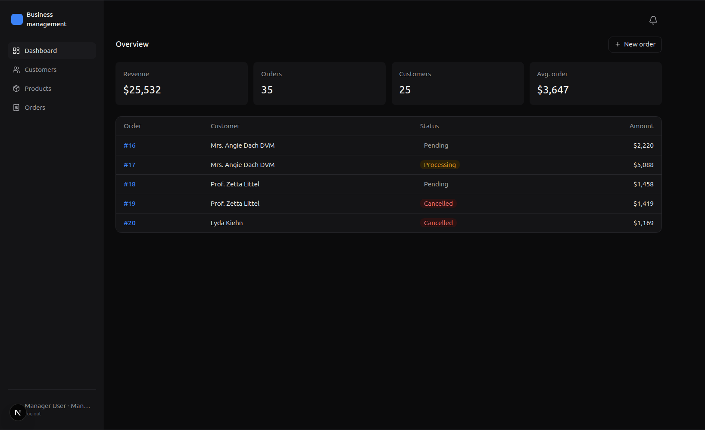
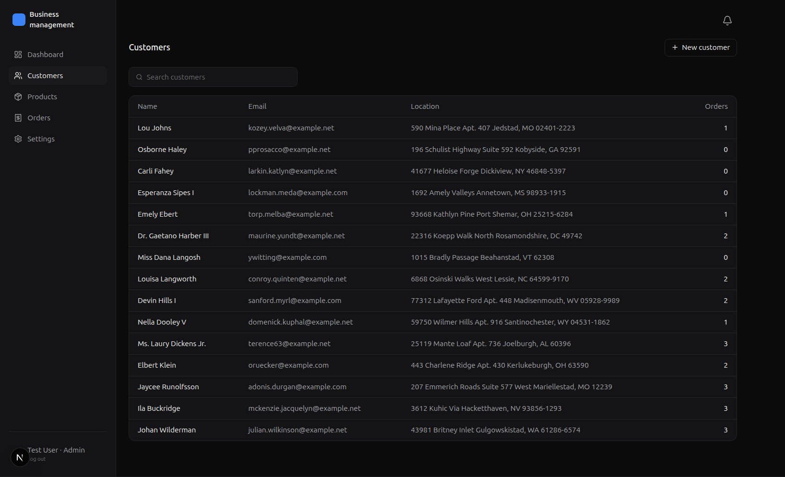
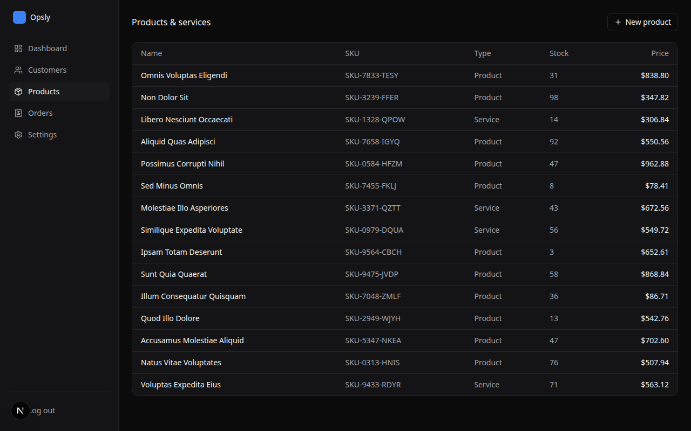
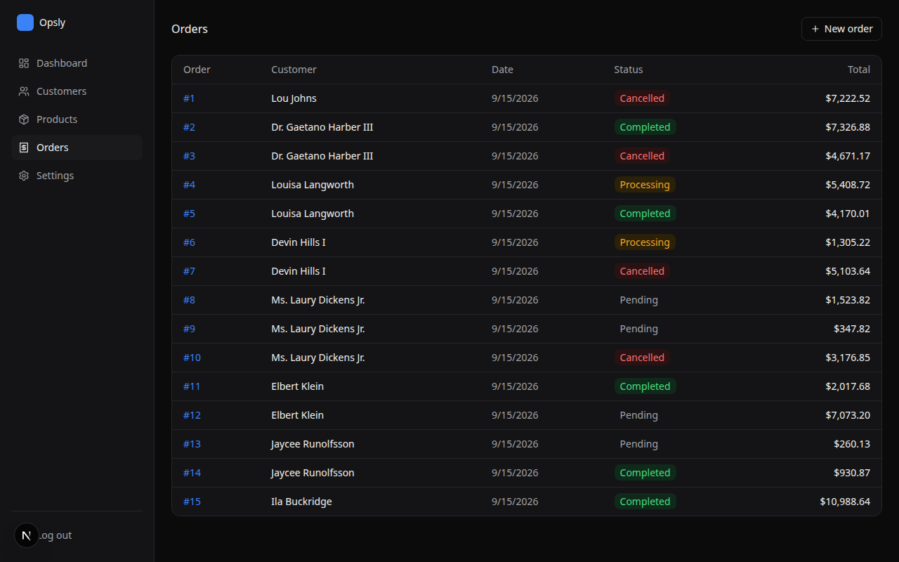
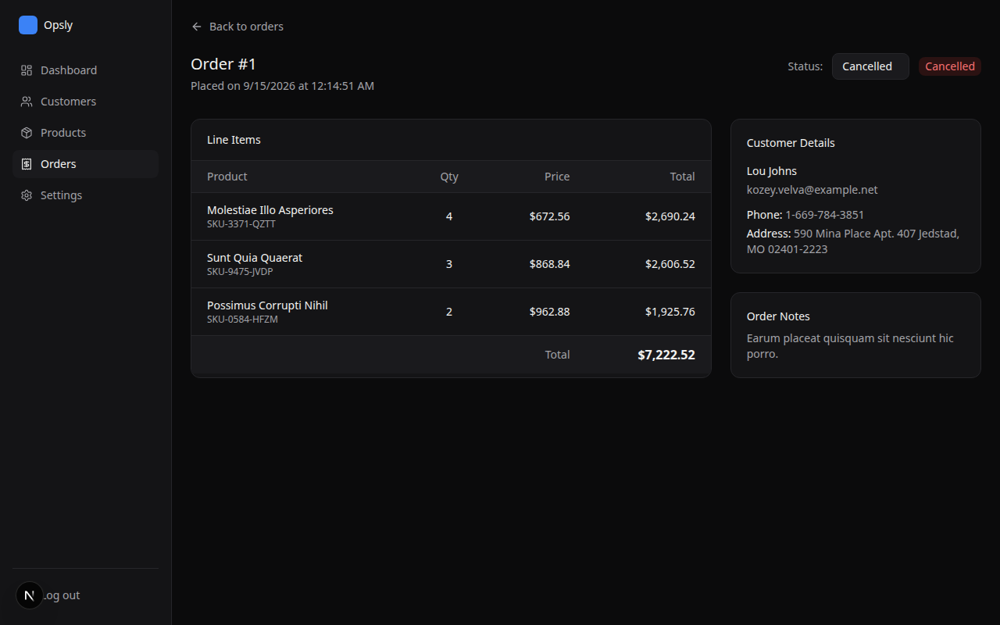

# Business management

**Business management** is a premium, full-stack Business Management Platform featuring a decoupled architecture with a **Laravel (PHP)** backend and a **Next.js (React)** frontend. It provides a sleek, dark-themed dashboard to manage Customers, Products, and Orders seamlessly.

## 🚀 Features

- **Customers Management:** Track customer details including name, email, phone, and address.
- **Products Catalog:** Manage your inventory with stock levels, SKUs, and service/product typing.
- **Orders Processing:** Create detailed multi-item orders with dynamic total calculation and status tracking (pending, processing, completed, cancelled).
- **Beautiful Dark UI:** A custom, flat/dark design system built natively with Vanilla CSS (no Tailwind dependency), providing a glassmorphism and premium aesthetic.
- **Robust API:** A RESTful JSON API using Laravel Sanctum for stateful cookie-based or token-based authentication.

## 📸 Screenshots

### Dashboard


### Customers Directory


### Products & Inventory


### Order Management


### Order Details


## 🛠 Tech Stack

- **Frontend:** [Next.js](https://nextjs.org/) (App Router), React, Vanilla CSS
- **Backend:** [Laravel 11](https://laravel.com/), SQLite (default for dev), Spatie Permissions
- **Authentication:** Laravel Sanctum

## 💻 Local Development Setup

### Prerequisites
- Node.js (v18+)
- PHP (v8.2+)
- Composer

### 1. Clone the repository
```bash
git clone https://github.com/HamzaElmansouri-Pr/Business-managment.git
cd "Business-managment"
```

### 2. Backend Setup (Laravel)
```bash
cd Business-backend
cp .env.example .env
composer install
php artisan key:generate
php artisan migrate:fresh --seed
php artisan serve
```
*The backend will be running on `http://localhost:8000`. The seeder automatically creates an admin user: `test@example.com` / `password`.*

### 3. Frontend Setup (Next.js)
```bash
cd ../Business-frontend
npm install
npm run dev
```
*The frontend will be running on `http://localhost:3000`. Open it in your browser and log in.*

## 📖 API Documentation

All API endpoints are prefixed with `/api/v1/` and require a Bearer token (or stateful Sanctum cookie) for access.

### Authentication
- `POST /v1/auth/login` - Authenticate user
- `POST /v1/auth/logout` - Revoke current session
- `GET /v1/auth/me` - Get current authenticated user

### Resources
For each resource, standard REST endpoints are available (`GET`, `POST`, `GET /{id}`, `PATCH /{id}`, `DELETE /{id}`).
- `/v1/customers`
- `/v1/products`
- `/v1/orders`

## 🚢 Deployment

For full deployment instructions (e.g. Vercel for Frontend, Railway/Forge for Backend), please refer to [DEPLOY.md](DEPLOY.md).
